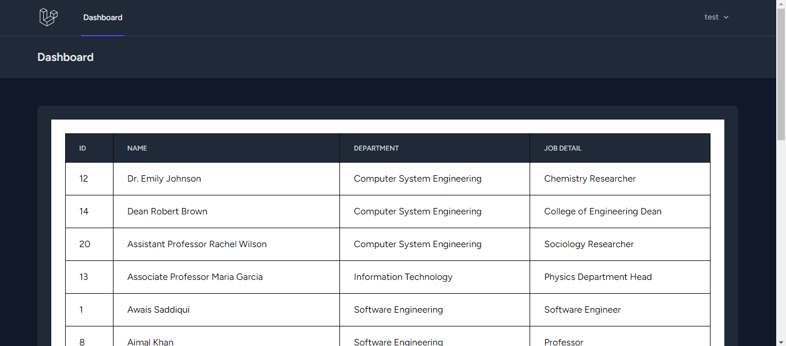
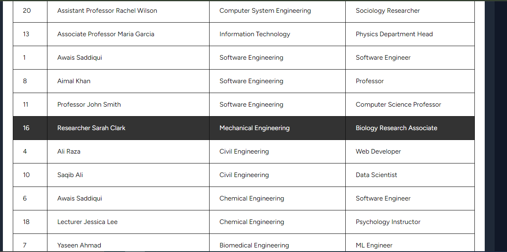

<p align="center"><a href="https://laravel.com" target="_blank"></a></p>

## Prerequisites
Before you begin, make sure you have Composer installed on your system. You can download Composer from <a href="https://getcomposer.org/download/" target="_blank"> here.</a>


## Step 1: Create Laravel Project
``` composer create-project laravel/laravel project-name ```

# Change your database name and database in .env file .

## Step 2: Install Laravel Breeze for Authentication
``` 
 composer require laravel/ui --dev 
 php artisan ui vue --auth 
 composer require laravel/breeze --dev 
 php artisan breeze:install 
```
## Step 3: Create Department Model
``` php artisan make:model Department ```
write your code in Department Model

## Step 4: Create Employees Table Migration
``` php artisan make:migration create_deparments_table ```
Write your code for the departments table.

## Step 5: make Departments Seeder
``` php artisan make:seeder DepartmentSeeder ```
Insert data into departments table.

## Step 6: Seed  Deparments
``` php artisan db:seed --class=DepartmentSeeder ```

This will seed the database with sample data for departments and employees.

## Step 7: Run Database Migrations
``` php artisan migrate ```

## Step 8: Create Employee Model
``` php artisan make:model Employee ```
write your code in Employee Model

## Step 9: Create Employees Table Migration
``` php artisan make:migration create_employees_table ```
Write your code for the employees table.

## Step 10: make Employees Seeder
``` php artisan make:seeder EmployeeSeeder ```
Insert data into Employees table.

## Step 11: Seed  Employees
``` php artisan db:seed --class=DepartmentSeeder ```

## Step 12: Run Database Migrations
``` php artisan migrate ```

## Step 13: Make a Employee Controller 
``` php artisan make:controller EmployeeController ```

## Step 14: Make a new route 
make a new route for a EmployeeController or simple add this code to your /routes/web.php 
``` Route::get('/dashboard', [EmployeeController::class, 'index'])->name('dashboard'); ```

Replace the function name "index" according to your function in EmployeeController .

## Step 15: Display your data on screen.
make a new file in views.
``` /resources/views/dashboard.blade.php ```


## Learning Laravel
Laravel has the most extensive and thorough documentation and video tutorial library of all modern web application frameworks, making it a breeze to get started with the framework.
# Output

