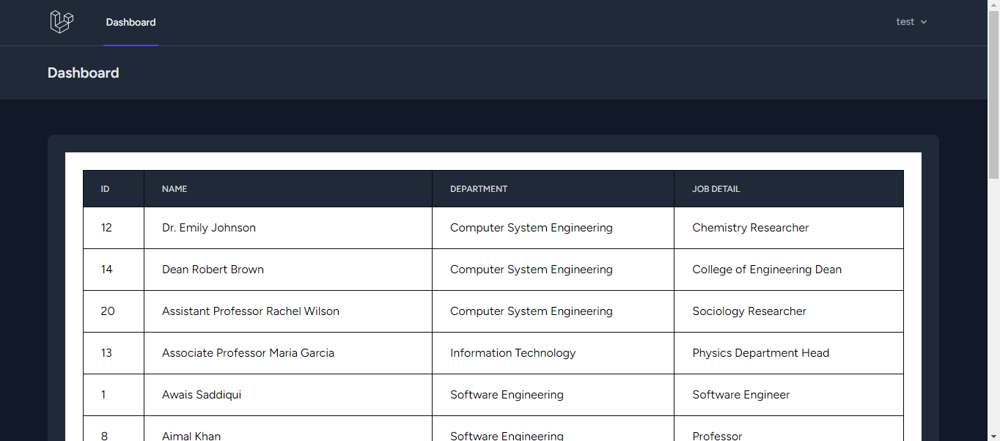
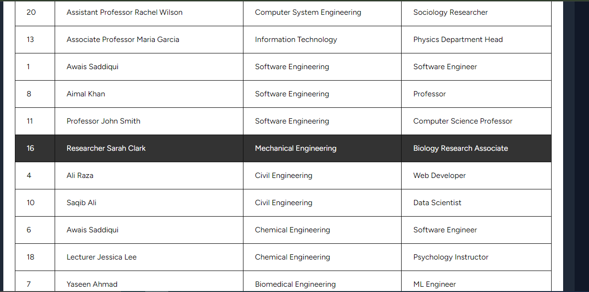

## Prerequisites
Before you begin, make sure you have Composer installed on your system. You can download Composer from here.<a href="https://getcomposer.org/download/">

## Step 1: Create Laravel Project
``` composer create-project laravel/laravel project-name ```
## Step 2: Install Laravel Breeze for Authentication
``` 
 composer require laravel/ui --dev 
 php artisan ui vue --auth 
 composer require laravel/breeze --dev 
 php artisan breeze:install 
```
## Step 3: Create Department Model
``` php artisan make:model Department ```

## Step 4: Create Employees Table Migration
``` php artisan make:migration create_employees_table ```

## Step 5: Run Database Migrations
``` php artisan migrate ```

## Step 6: Seed Departments and Employees
``` 
php artisan make:seeder DepartmentSeeder
php artisan make:seeder EmployeeSeeder
php artisan db:seed --class=DepartmentSeeder
php artisan db:seed --class=EmployeeSeeder

```
This will seed the database with sample data for departments and employees.

Now you have successfully set up a Laravel project with authentication and seeded database tables. You can start building your application!

## Learning Laravel
Laravel has the most extensive and thorough documentation and video tutorial library of all modern web application frameworks, making it a breeze to get started with the framework.


